# CalFit
  ### **채용 일정을 통합 관리하고 자동으로 조율하는 B2B 채용 일정 관리 ATS**

  <div align="center">
    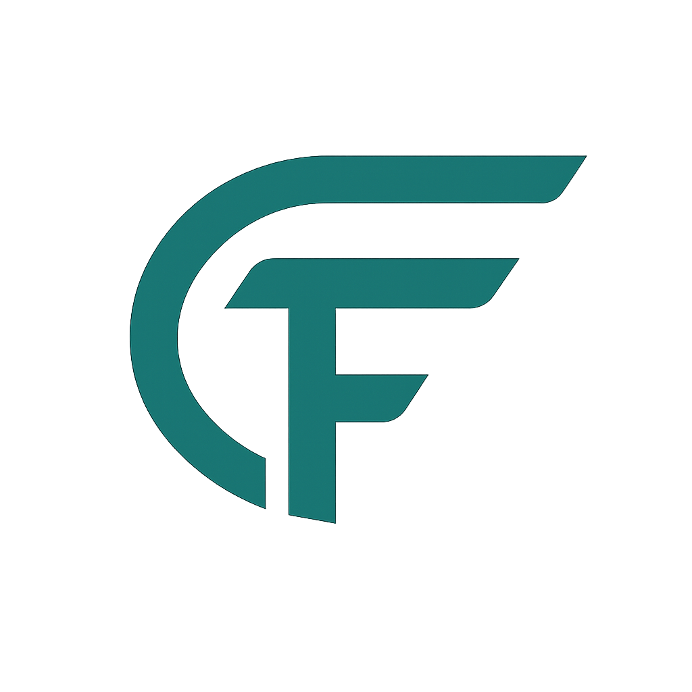
  </div>

  <div align="center">
  BEYOND SW CAMP 21기 Team Coffinees

  </div>

  <br/>

  > **CalFit**은 공고 등록, 지원자 관리, 면접 일정 생성, 회의실 예약, 구글 캘린더 연동까지
  > 채용 운영 과정에서 흩어져 있던 일정을 하나의 흐름으로 통합 관리하는 **B2B 채용 일정 관리 ATS**입니다.

  ---

  <br/>

  ## 목차
  ### 1. 프로젝트 소개
  ### 2. 팀 소개
  ### 3. 문제 정의
  ### 4. 서비스의 필요성
  ### 5. 기획 의도
  ### 6. 타깃 사용자와 핵심 시나리오
  ### 7. 서비스 소개 및 차별점
  ### 8. 개발 환경 및 기술 스택
  ### 9. 시스템 아키텍처
  ### 10. 프로젝트 구조
  ### 11. WBS
  ### 12. ERD
  ### 13. 설계 및 구현
  ### 14. 문서 링크 모음
  ### 15. 트러블 슈팅
  ### 16. 아쉬운 점 / 한계
  ### 17. 향후 계획
  ### 18. 회고

  <br/>

  ---

  <br/>

  ## 1. 프로젝트 소개

  ### CALFIT
  - **채용 일정 관리 ATS**
  - **면접 일정을 통합 관리하고 자동으로 조율하는 채용 운영 시스템**
  - 지원자, 면접관, 회의실, 전형 일정을 통합 관리해 기업의 채용 운영을 효율화하는 서비스입니다.

  ### 프로젝트 소개
  - **CalFit**은 Calendar + Fit이라는 이름처럼 공고 등록부터 지원, 면접 조율, 회의실 예약까지 흩어진 채용 일정을 한곳에 맞춰주는 채용 일정 서비스입니다.
  - 단순한 ATS 기능 제공을 넘어서, **면접 일정 확정 과정에서 발생하는 조율 비용과 커뮤니케이션 비용을 줄이는 scheduling-first 서비스**를 지향합니다.
  - 채용 담당자는 공고, 지원자, 일정, 회의실, 알림, 리포트를 한 플랫폼에서 관리할 수 있고, 면접관은 배정된 일정을 즉시 확인할 수 있습니다.

  <br/>

  ———
  <br/>

  ## 2. 팀 소개
  <table width="100%">
    <thead>
      <tr align="center">
        <th width="20%">강윤혜</th>
        <th width="20%">송형욱</th>
        <th width="20%">이관호</th>
        <th width="20%">이인재</th>
        <th width="20%">진희헌</th>
      </tr>
    </thead>
    <tbody>
      <tr align="center">
        <td></td>
        <td></td>
        <td></td>
        <td></td>
        <td></td>
      </tr>
    </tbody>
    <tbody>
      <tr align="center">
        <td>인프라, 자동화</td>
        <td>PM, 일정, 채용</td>
        <td>플랫폼, 결제/통계</td>
        <td>보안, 인증/권한</td>
        <td>기획, 스케줄링</td>
      </tr>
      <tr align="center">
        <td>지원자 칸반 보드<br/>자동화 트리거<br/>시스템 알림</td>
        <td>채용 공고<br/>구글 캘린더 연동<br/>내 일정<br/>면접 일정</td>
        <td>멀티테넌시<br/>결제/요금제<br/>채용 홈페이지<br/>통계</td>
        <td>지원자 Excel 추출<br/>지원서 템플릿<br/>이메일 시스템<br/>인증/인가</td>
        <td>공지사항<br/>회의실 일정<br/>스케줄링 알고리즘</td>
      </tr>
    </tbody>
  </table>
  <br/>

  ———
  <br/>

  ## 3. 문제 정의

  ### 문제점 발견

  #### 1. 분산된 채용 운영 도구

  - 공고 등록, 지원자 관리, 면접 일정 조율, 회의실 예약, 결과 안내가 각각 다른 도구에서 관리되어 정보를 일관되게 파악하기 어려웠습니다.
  - 채용 운영에 필요한 정보가 하나의 흐름으로 연결되지 않아 일정 변경 사항이 즉시 반영되지 못했습니다.

  #### 2. 데이터 불일치와 운영 혼선

  - 일정 충돌, 안내 누락, 협업 지연이 반복적으로 발생했습니다.
  - 담당자는 채용 현황을 통합적으로 파악하기 어려웠고, 전체 운영 효율과 프로세스의 일관성이 저하되었습니다.

  #### 3. 반복되는 수동 커뮤니케이션

  - 일정 하나를 확정하기 위해 담당자와 면접관 간 반복적인 확인이 필요했습니다.
  - 변경 사항도 즉시 공유되기 어려워 불필요한 커뮤니케이션 비용이 발생했습니다.

  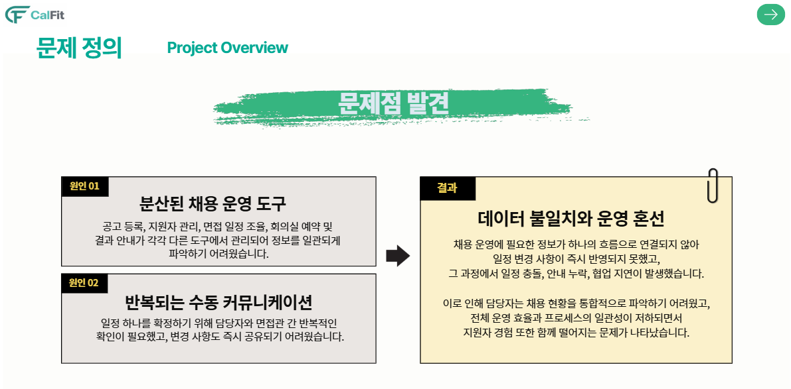
  <br/>

  ———
  <br/>

  ## 4. 서비스의 필요성

  - 중소기업의 ATS 도입 수요가 증가하고 있으며, 채용 운영의 자동화 필요성이 높아지고 있습니다.
  - 충원 소요는 길고, 채용 담당자 1인이 다수의 채용 요청을 관리해야 하는 상황에서 일정 조율과 Q&A 대응 부담이 큽니다.
  - 공고, 지원자, 일정, 회의실, 알림을 통합 관리하는 시스템이 필요합니다.

  ### CalFit이 해결하려는 것

  - 통합 관리
  - 수작업 최소화
  - 정보 일관성 확보
  - 채용 경험 개선

  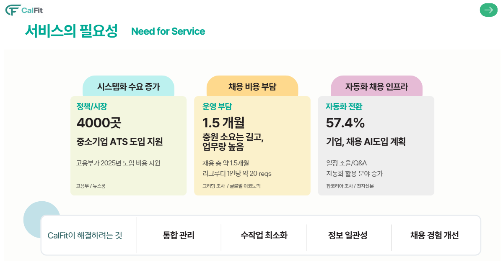
  <br/>

  ———
  <br/>

  ## 5. 기획 의도

  ### 1. 채용 운영의 통합 관리

  - 공고 등록, 지원자 관리, 면접 일정, 회의실 예약 등의 분산된 업무를 하나의 플랫폼에 연결하고자 했습니다.

  ### 2. 수작업 업무 최소화

  - 반복적인 일정 조율과 커뮤니케이션을 줄이기 위해 알림, 일정 관리, 연동 기능을 통해 운영 부담을 낮추고자 했습니다.

  ### 3. 정보 일관성 확보

  - 채용 과정에서 발생하는 데이터를 하나의 워크스페이스 안에서 관리하여 정보 누락과 혼선을 줄이고자 했습니다.

  ### 4. 채용 경험 개선

  - 담당자와 면접관의 협업 효율을 높이고, 지원자에게도 일관되고 신뢰도 높은 채용 경험을 제공하고자 했습니다.

  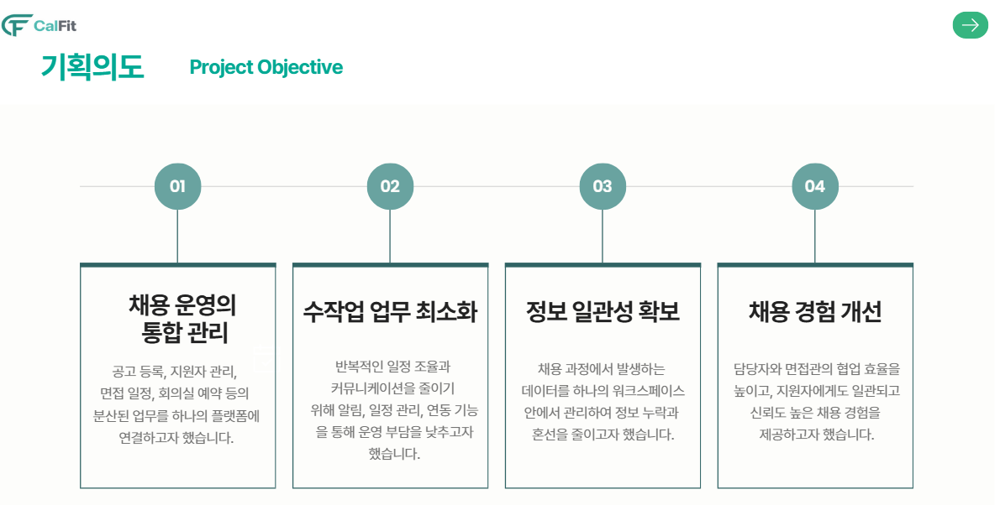
  <br/>

  ———
  <br/>

  ## 6. 타깃 사용자와 핵심 시나리오

  ### 타깃 사용자

  - 채용 담당자(HR)
  - 면접관
  - 워크스페이스 관리자
  - 채용 운영팀

  ### 핵심 시나리오

  1. 워크스페이스를 생성하고 팀원을 초대합니다.
  2. 채용 공고와 지원서 템플릿을 생성합니다.
  3. 지원자를 칸반보드에서 단계별로 관리합니다.
  4. 면접관, 지원자, 회의실 정보를 바탕으로 면접 일정을 생성하거나 자동 배정합니다.
  5. 생성된 일정은 알림, 내 일정, 구글 캘린더와 연동됩니다.
  6. 리포트와 결제 기능으로 운영 현황과 SaaS 수익 구조를 함께 관리합니다.

  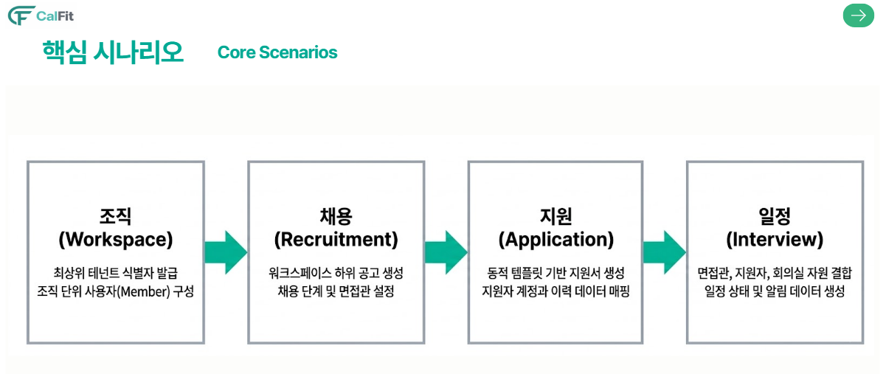
  <br/>

  ———
  <br/>

  ## 7. 서비스 소개 및 차별점

  ### 기존 서비스

  #### Greenhouse / Workable

  - ATS 안에 scheduling 도구를 내장한 범용 채용 관리 도구

  #### 나인하이어 / 그리팅

  - 채용 홈페이지, 지원자 관리, 커뮤니케이션을 포함한 올인원 채용 도구

  ### CalFit의 차별화 포지셔닝

  - CalFit은 ATS의 일정 기능이 아니라 면접 일정 확정 과정의 낭비를 줄이는 scheduling-first 서비스입니다.
  - 지원자와의 반복 조율보다 내부 자원 확정에 우선순위를 둡니다.
  - 면접관, 회의실, 면접 단계 등 복수 자원을 동시에 최적화합니다.
  - 채용 담당자의 재조율 비용과 커뮤니케이션 비용을 줄이는 데 집중합니다.


  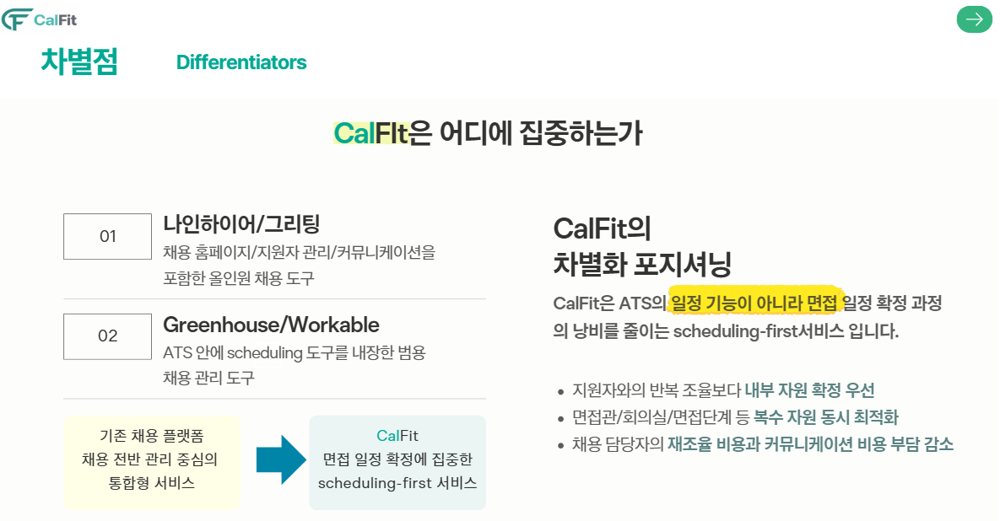
  <br/>

  ———
  <br/>

  ## 8. 개발 환경 및 기술 스택
  <div align="center">

  ### Design
  

  ### Frontend
  
  
  
  
  
  

  ### Database
  

  ### Backend
  
  
  
  
  
  
  

  ### External Integration
  
  
  

  ### Collaboration
  
  
  
  

  ### CI/CD
  
  
  
  
  
  </div>
  <br/>

  ———
  <br/>

  ## 9. 시스템 아키텍처

  ### System Architecture

  - 프론트엔드는 Vue 기반 SPA로 구성하고, 백엔드는 Spring Boot 멀티 모듈 구조로 설계하였습니다.
  - 외부 연동 기능은 Google Calendar, 결제 시스템 등과 연결되며, 데이터 저장은 MySQL을 활용합니다.
  - 배포는 Docker, GitHub Actions, EC2, S3, CloudFront 기반으로 자동화하였습니다.

  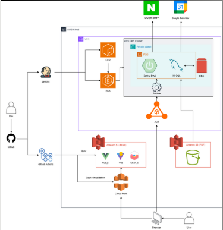
  <br/>

  ———
  <br/>

  ## 10. 프로젝트 구조

### Backend (BE)

  ```text

  BE
  ├─ core
  │  ├─ core-api
  │  ├─ core-enum
  │  ├─ domain-announcement-board
  │  ├─ domain-applicant
  │  ├─ domain-application
  │  ├─ domain-billing
  │  ├─ domain-calendar
  │  ├─ domain-career
  │  ├─ domain-interview
  │  ├─ domain-meeting-room
  │  ├─ domain-notification
  │  ├─ domain-payment
  │  ├─ domain-recruitment
  │  ├─ domain-report
  │  ├─ domain-user
  │  └─ domain-workspace
  ├─ storage
  │  └─ db-core
  ├─ support
  │  ├─ email
  │  ├─ error
  │  ├─ event
  │  ├─ logging
  │  ├─ monitoring
  │  └─ security
  ├─ clients
  │  └─ google-calendar
  ├─ docker
  ├─ gradle
  ├─ scripts
  ├─ build.gradle
  ├─ settings.gradle
  ├─ Dockerfile
  └─ docker-compose.yml
```

### Frontend (FE)

```text

  FE
  ├─ public
  ├─ src
  │  ├─ api
  │  ├─ components
  │  ├─ composables
  │  ├─ data
  │  ├─ layouts
  │  ├─ router
  │  ├─ stores
  │  ├─ types
  │  ├─ utils
  │  ├─ views
  │  │  ├─ admin
  │  │  ├─ billing
  │  │  ├─ interview
  │  │  └─ meeting-rooms
  │  ├─ App.vue
  │  ├─ main.js
  │  └─ style.css
  ├─ index.html
  ├─ package.json
  ├─ package-lock.json
  ├─ vite.config.js
  ├─ tailwind.config.js
  └─ postcss.config.js
```
  <br/>

  ———
  <br/>

  ## 11. WBS

  - 팀 컨벤션 설계
  - 데이터베이스 설계
  - 화면 구조 설계
  - 서버 세팅
  - 프론트엔드 작성
  - 백엔드 작성
  - TDD 및 API 문서화
  - CI / CD

  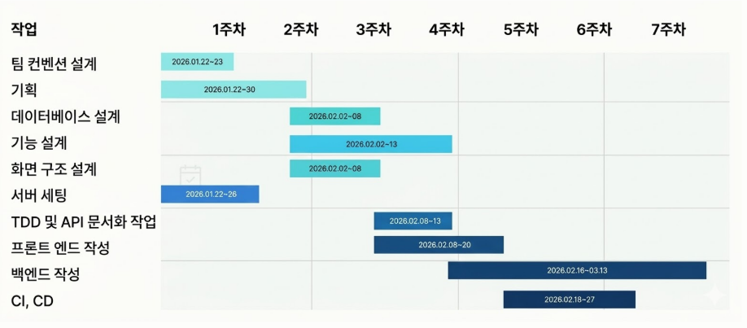
  <br/>

  ———
  <br/>

  ## 12. ERD

  - 워크스페이스, 사용자, 그룹, 채용 공고, 지원자, 지원서, 면접 일정, 회의실, 알림, 결제, 리포트 도메인을 중심으로 설계하였습니다.
  - 채용 도메인과 일정 도메인이 자연스럽게 연결되도록 관계를 구성하였습니다.

  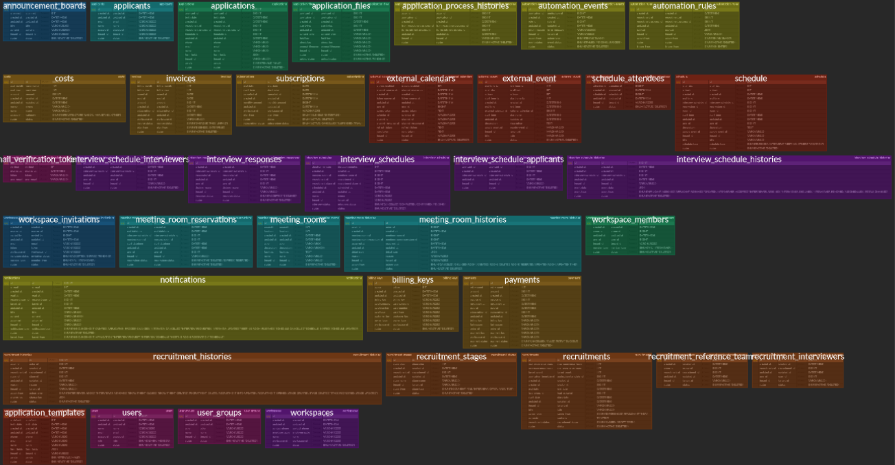
  <br/>

  ———
  <br/>

  ## 13. 설계 및 구현

  ### 1. 워크스페이스 생성

  - 구조화된 워크스페이스 정보를 입력하여 채용 운영 공간 생성
  - 생성 즉시 멀티테넌트 환경이 구성되어 독립된 채용 공간에서 업무 시작 가능

  기대 효과

  - 최소한의 입력으로 빠르게 서비스 시작 가능
  - 워크스페이스 단위 데이터 격리를 통한 기업별 데이터 보안 확보

  <details>
    <summary>GIF 보기</summary>
    <br/>
    
  </details>

  ———

  ### 2. 채용 공고 생성

  - 공고 기본 정보와 담당 및 참조 조직을 지정하여 협업 대상과 권한을 설정
  - 직군별 특성에 맞춰 서류, 코딩 테스트, 면접 등 채용 단계를 자유롭게 구성 가능

  설계 의도

  - 포지션별로 다른 채용 프로세스를 유연하게 수용
  - 구조화된 템플릿 및 조직 데이터와 이후 일정 배정 로직 연결

  <details>
    <summary>GIF 보기</summary>
    <br/>
    
  </details>

  ———

  ### 3. 회의실 수동 예약

  - 회의실 화면에서 일·주·월 단위 일정표 확인 가능
  - 원하는 시간 칸을 직접 선택해 예약 가능
  - 회의 제목, 시간, 참석자 등 예약 정보 입력 가능
  - 입력한 내용을 바탕으로 회의실 수동 예약 생성 가능
  - 예약 완료 후 일정표에 즉시 반영되어 확인 가능

  기대 효과

  - 회의실 예약 과정을 직관적으로 처리 가능
  - 수동 예약이 필요한 상황에서도 빠른 대응 가능
  - 회의실 사용 현황을 한 화면에서 효율적으로 관리 가능

  <details>
    <summary>GIF 보기</summary>
    <br/>
    
  </details>

  ———

  ### 4. 지원서 작성

  - 공고별 맞춤 지원서 제공
  - 채용 공고에 따라 다른 지원서 템플릿 적용
  - 필요한 정보만 입력받도록 구성
  - 첨부 파일은 S3에 저장하여 안정성 확보

  기대 효과

  - 맞춤형 지원 정보 수집 가능
  - 지원 편의성과 검토 효율 동시 향상
  - 채용 운영 흐름의 일관성과 관리 편의성 확보

  <details>
    <summary>GIF 보기</summary>
    <br/>
    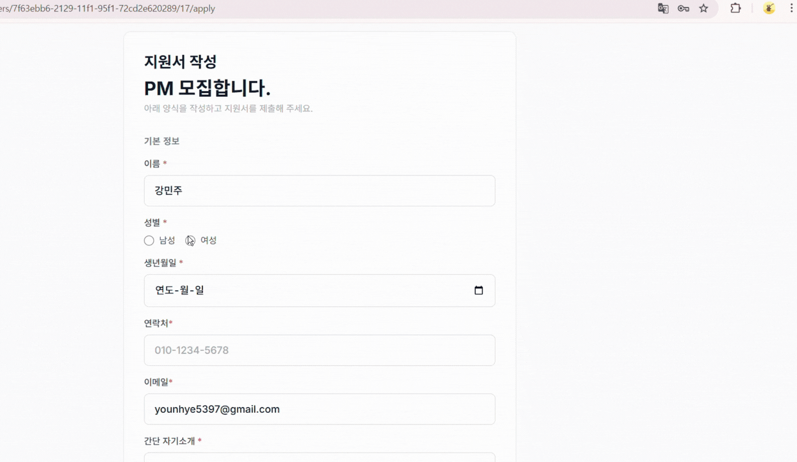
  </details>

  ———

  ### 5. 지원자 칸반보드

  - 채용 단계별 지원자 현황을 칸반 보드 형태로 한눈에 확인
  - HR이 지원자 단계 이동 시 현재 진행 상태 즉시 반영
  - 특정 단계 진입 시 자동화 규칙 실행
  - 합격/불합격/면접 요청 메일 자동 발송

  기대 효과

  - 채용 진행 현황을 한 화면에서 체계적으로 관리 가능
  - 후속 작업 자동화
  - 운영 실수 최소화 및 협업 효율 향상

  <details>
    <summary>GIF 보기</summary>
    <br/>
    
  </details>

  ———

  ### 6. 지원자 엑셀 파일 다운로드

  - 데이터 정합성 보장을 위한 UTF-8 파일 인코딩 적용
  - 검색된 지원자가 0명인 경우에도 빈 양식 다운로드 지원
  - 지원자 핵심 정보를 엑셀 열 구조에 맞춤 매핑

  기대 효과

  - 실무자의 정렬, 필터, 결과 취합 지원
  - 데이터 깨짐 및 재검토 비용 절감
  - 2차 데이터 가공 작업에 활용 가능

  <details>
    <summary>GIF 보기</summary>
    <br/>
    
  </details>

  ———

  ### 7. 면접 일정 생성

  - 채용 공고 상세페이지에서 면접 일정 생성 진행
  - 면접 전형 선택 가능
  - 면접관 지정 후 참여 인원 구성 가능
  - 지원자 선택 후 전형 대상 확정 가능
  - 회의실 일정 선택을 통해 가능한 시간대 반영
  - 입력한 정보 기반으로 면접 일정 생성 완료 가능

  기대 효과

  - 면접 일정 생성 과정을 한 화면에서 빠르게 진행 가능
  - 면접관, 회의실 정보를 통합해 일정 조율 효율 향상
  - 수작업 조율 과정을 줄여 면접 운영 편의성 강화

  <details>
    <summary>GIF 보기</summary>
    <br/>
    
  </details>

  ———

  ### 8. 면접관 일정 적용

  - 면접 일정 생성 시 면접관에게 즉시 알림 전달
  - 생성된 면접 일정이 면접관 개인 일정에 자동 반영
  - 면접관 로그인 후 내 일정에서 배정된 면접 일정 확인 가능

  알림 연동

  - 일정 변경 사항도 빠르게 인지 가능
  - 중요 일정 전달 과정을 자동화하여 확인 편의성 강화

  기대 효과

  - 전달 누락 최소화
  - 면접관의 일정 확인 속도 향상
  - 일정 확인과 협업에 드는 시간 감소

  <details>
    <summary>GIF 보기</summary>
    <br/>
    
  </details>

  ———

  ### 9. 내 일정 등록 및 구글 캘린더 연동

  - 구글 계정 인증(OAuth 2.0)을 통해 캘린더 접근 권한 획득
  - 내부 일정들을 구글 캘린더와 실시간 동기화

  설계 의도

  - 면접관이 별도 앱 접속 없이 기존 업무 환경에서 일정 확인 가능
  - B2B 환경에서 가장 범용적인 캘린더와 자연스럽게 연동

  <details>
    <summary>GIF 보기</summary>
    <br/>
    
  </details>

  ———

  ### 10. 참석자 및 회의실 일정 관리

  - 일정 생성 시 회의실과 참석자를 추가하는 과정에서 실시간으로 기존 일정과의 겹침 여부를 자동 검증 및 표시
  - 일정 등록 완료 시 참석자 및 관리자에게 시스템 알림 발송

  설계 의도

  - 다수 면접관의 일정 조율 비용 절감
  - 시간 및 공간의 중복 예약 원천 차단
  - 실시간 일정 정합성 유지

  <details>
    <summary>GIF 보기</summary>
    <br/>
    
  </details>

  ———

  ### 11. 개인 일정과 채용 대시보드 동기화

  - 일반 업무 일정 생성 시 채용 공고별 대시보드 캘린더에 실시간 통합 반영
  - 개인 캘린더와 채용 캘린더 간 데이터 연결을 통해 전체 가용 시간을 단일 뷰 제공

  설계 의도

  - 면접 외 타 업무 일정도 자동 추천 알고리즘의 기반 데이터로 활용
  - 개인 업무와 면접 일정 간 충돌 사전 방지

  <details>
    <summary>GIF 보기</summary>
    <br/>
    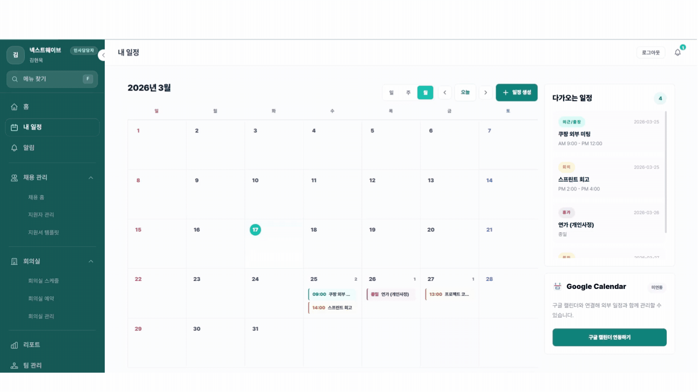
  </details>

  ———

  ### 12. 리포트

  - KPI 대시보드: 전체 지원자, 진행 중 공고, 채용 전환율, 합격자 수 등 핵심 지표 노출
  - 분석 탭: 전형 단계별 지원자 분포, 월별 유입 추이
  - 공고 성과: 공고별 지원자 현황 및 목표 달성률
  - 면접 운영: 면접 상태 분포, 취소율, 회의실 사용 현황
  - 자동화: 자동화 규칙 실행 성공/실패율 및 채널별 통계

  설계 의도

  - 데이터 기반 채용 의사결정 지원
  - 병목 구간과 공고별 효율을 시각적으로 파악해 개선점 도출

  <details>
    <summary>GIF 보기</summary>
    <br/>
    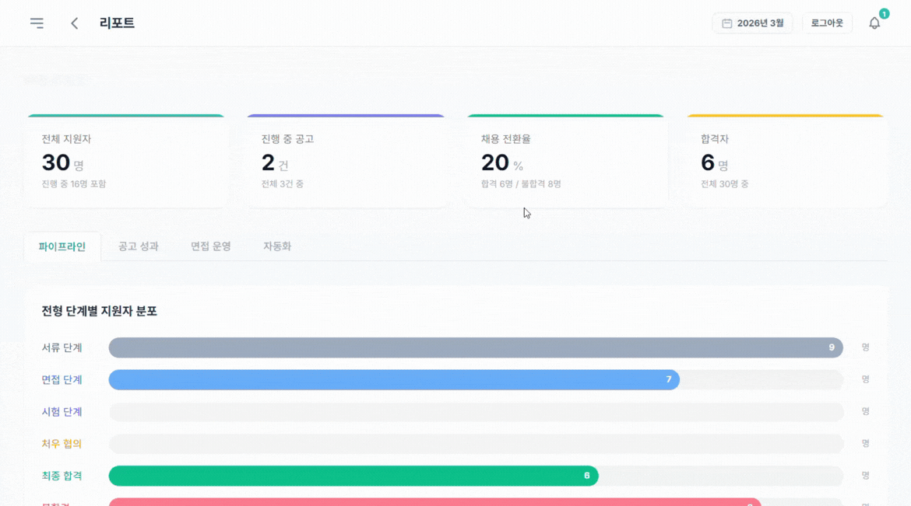
  </details>

  ———

  ### 13. 통계 / SaaS 운영

  - FI와 CO를 분리하여 수익성과 비용 구조를 체계적으로 분석
  - FI 대시보드: MRR, 구독자 수, 이탈률 등 KPI
  - 구독 관리: 요금제별 구독 현황 조회 및 검색
  - 인보이스: 월별 확정 매출, 미결제, 연체 인보이스 관리
  - CO 비용 관리: 카테고리별 비용 등록 및 추이 분석
  - 손익 리포트: 월별 매출, 비용, 영업이익, 영업이익률 추적

  설계 의도

  - SaaS 수익성을 체계적으로 분석하고 운영 의사결정 지원

  <details>
    <summary>GIF 보기</summary>
    <br/>
    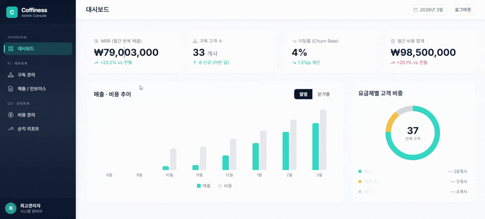
  </details>
  <br/>

  ———
  <br/>

  ## 14. 문서 링크 모음

### 기획 및 설계

- [요구사항 정의서](https://docs.google.com/spreadsheets/d/1RoJoCTA-AA3jKplup3AmF92ofQRGaEgE5Nc6EgAMMRc/edit?gid=363935461#gid=363935461)
- [WBS](https://docs.google.com/spreadsheets/d/1RoJoCTA-AA3jKplup3AmF92ofQRGaEgE5Nc6EgAMMRc/edit?gid=330943484#gid=330943484)
- [ERD](https://www.erdcloud.com/d/QKvKe7J6yBHRCFsF4)

### UI / UX

- [화면 설계서(Figma)](https://www.figma.com/design/bHbzp6OqQBrMYL8ORDcqDA/Final?node-id=1367-13362&p=f&t=BnkS9WJrOH5kW9d0-0)
- [UI/UX 테스트 결과서](https://docs.google.com/spreadsheets/d/1RoJoCTA-AA3jKplup3AmF92ofQRGaEgE5Nc6EgAMMRc/edit?gid=1206072661#gid=1206072661)

### API & 테스트

- [단위 테스트 결과](https://docs.google.com/spreadsheets/d/1RoJoCTA-AA3jKplup3AmF92ofQRGaEgE5Nc6EgAMMRc/edit?gid=977820475#gid=977820475)
- [통합 테스트 결과](https://docs.google.com/spreadsheets/d/1RoJoCTA-AA3jKplup3AmF92ofQRGaEgE5Nc6EgAMMRc/edit?gid=337106314#gid=337106314)

### 협업 및 형상 관리

- [Notion](https://www.notion.so/coffit23/6-coffiness-2efa02b1ffb180ab9fead1b12654a555)

  <br/>

  ———
  <br/>

  ## 15. 트러블 슈팅

  ### 1. 중복 예약 Race Condition 문제

  문제: 복수의 인사 담당자가 동일 시간대, 동일 회의실로 면접 일정을 동시에 생성할 경우 중복 예약 발생

  원인: 저장 이전에 예약 가능 여부를 선조회하는 구조로 인해 검증 시점과 저장 시점 사이 Race Condition 발생

  해결: 핵심 자원에 비관적 락을 적용하고, 락 획득 후 충돌 여부를 재검증하는 방식으로 동시성 제어 적용

  결과:

  - 동시 요청 중복 예약 차단
  - 면접 일정, 회의실 예약, 연관 엔티티 간 데이터 정합성 안정적으로 확보

  ———

  ### 2. 회의실 예약 목록 조회의 N+1 문제

  문제: 회의실 예약 목록 조회 시 예약마다 상세 정보 조회가 반복되어 예약 수가 늘수록 응답 성능 저하

  원인: 예약별로 일정, 참석자, 면접관, 지원자, 회의실, 사용자 정보를 반복 조회하는 N+1 구조 발생

  해결: 한 ID를 먼저 수집한 뒤 관련 데이터를 일괄 조회하고 메모리에서 조합하는 방식으로 개선

  결과

  - 예약 10건 기준 SQL 호출 수를 81회에서 8회로 줄여 약 90.1% 성능 개선

  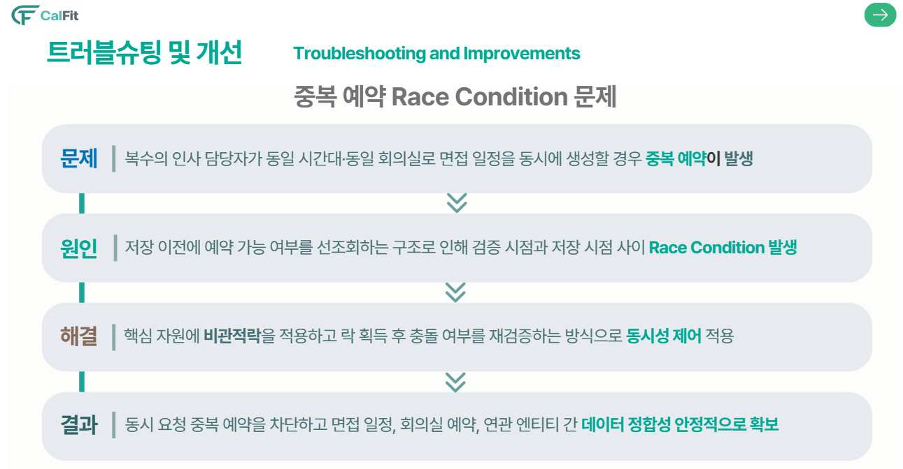
  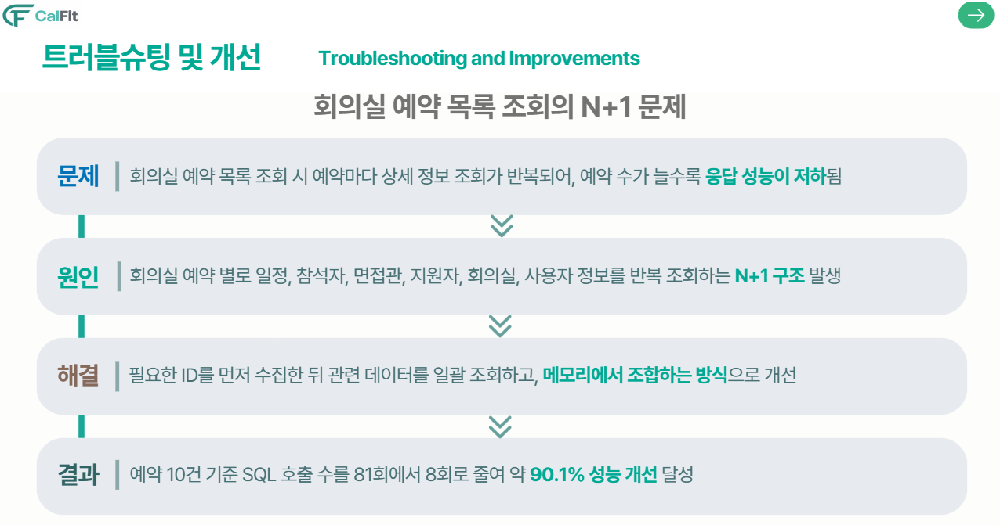
  <br/>

  ———
  <br/>

  ## 16. 아쉬운 점 / 한계

  ### 코드 리뷰 부족

  - 프로젝트 일정에 쫓겨 충분한 코드 리뷰 없이 머지하는 경우가 발생했습니다.
  - 이로 인해 코드 스타일 불일치와 잠재적 버그를 조기에 발견하지 못한 부분이 있었습니다.

  ### 아키텍처 리팩토링

  - 초기에 4계층 레이어드 아키텍처로 구현했으나 도메인 모듈 간 순환 의존성 문제가 발생했습니다.
  - 퍼사드 패턴을 도입해 구조를 개선했지만, 초기 설계를 더 견고하게 잡았다면 소요 시간을 줄일 수 있었을 것이라는 아쉬움이 남았습니다.

  ### 대규모 데이터 고려 부족

  - 기능 구현에 집중하면서 성능 최적화까지 충분히 신경쓰지 못했습니다.
  - Fetch Join, QueryDSL 기반 벌크 조회 등으로 추가 개선할 여지가 있습니다.

  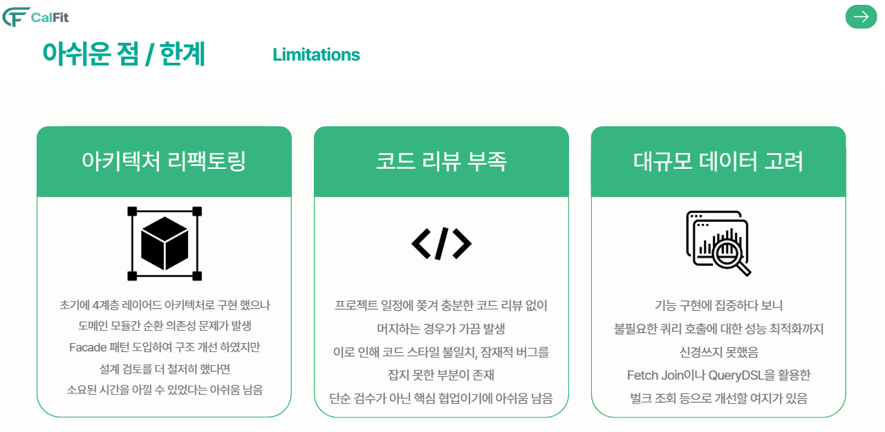

  <br/>

  ———
  <br/>

  ## 17. 향후 계획

  - 대규모 고객 대응 시 Schema 분리 전략 검토
  - Prometheus + Grafana 기반 시스템 메트릭 수집
  - 장애 조기 감지 및 알림 체계 구축
  - 서비스 규모 증가에 따른 점진적 MSA 전환 검토
  - 도메인 간 통신을 이벤트 브로커 기반으로 전환 검토
  - 읽기 빈도가 높은 API에 Redis 캐싱 적용
  - 자주 변경되지 않는 데이터 캐싱을 통한 응답 속도 개선

  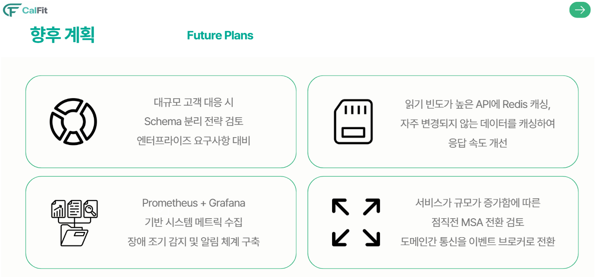
  <br/>

  ———
  <br/>

  ## 18. 회고
  <details>
  <summary style="font-size:1.1em;">강윤혜</summary>
  <div markdown="1">

  지원자 로그인/회원가입, 지원서 파일 업로드, 칸반 기능을 맡아 프로젝트에 참여하였다. 구현과 테스트를 진행하면서 각 기능이 독립적으로 동작하는 것보다 권한 처리, 상태 변화, 데이터 흐름이 자연스럽게 이어지도록 설계하는 일이 중요하다는 점을 깨달았다. 특히 파일 업로드에서는 업로드 전후 상태를 나누어 흐름을 구성하며 데이터 정합성을 맞추고자 하였고, 칸반에서는 단계 이동 시 데이터가 꼬이지 않도록 상태 전이를 기준으로 로직을 정리하였다. 이 과정을 통해 데이터가 저장되고 연결되는 흐름까지 염두에 두고 로직을 설계하는 시각을 기를 수 있었다. 
  </div>
  </details>
  <details>
  <summary style="font-size:1.1em;">송형욱</summary>
  <div markdown="1">

  채용·면접·일정처럼 서로 강하게 연결된 도메인을 직접 설계하고 구현하면서, 기능 하나를 만드는 것보다 각 도메인의 책임과 정합성을 어떻게 나눌지가 서비스 완성도에 훨씬 큰 영향을 준다는 점을 배웠다. 특히 상태 변화와 권한, 일정 충돌처럼 실제 업무 흐름이 얽힌 문제를 다루며, 도메인 로직을 명확하게 설계하는 것이 곧 사용자 경험과 운영 안정성으로 이어진다는 것을 체감했다.

  또한 이번 프로젝트를 통해 멀티테넌시, 도메인 분리, 성능 최적화까지 함께 고려하는 아키텍처 설계의 중요성을 크게 느꼈고, 현재 구조도 의미 있었지만 일부 영역은 더 클린하게 분리하고 경계를 명확히 했다면 유지보수성과 확장성이 더 좋아졌겠다는 아쉬움도 남았다. 앞으로는 이런 경험을 바탕으로 기능 구현을 넘어, 장기적인 운영과 확장까지 고려한 구조를 설계할 수 있는 개발자로 성장하고 싶다.
  </div>
  </details>
  <details>
  <summary style="font-size:1.1em;">이관호</summary>
  <div markdown="1">
    
    멀티테넌시, 요금제/결제, 관리자 통계, 멤버/그룹 권한을 맡아 참여하였습니다. 워크스페이스 생성에 테넌트 설정, 구독, 멤버 등록이 엮여 있어 도메인 간 연결 설계의 중요성을 느꼈고, 결제 생명주기를 직접 설계하며 상태 전이와 예외 처리의 중요성을 배웠습니다. 통합 테스트를 마무리하지 못한 점이 아쉬우며, 앞으로는 도메인 연결과 운영까지 고려하는 개발자가 되고 싶습니다.
  </div>
  </details>
  <details>
  <summary style="font-size:1.1em;">이인재</summary>
  <div markdown="1">
    
    Calfit 프로젝트에서 서비스 전반의 보안을 책임지는 안전한 인증/인가 체계를 구축하고 동적인 폼 생성을 위한 커스텀 지원서 템플릿 구조화, 합격/불합격 안내를 위한 이메일 시스템, 대용량 지원자 데이터 Excel 다운로드 등 실사용자(HR 담당자)에게 밀접한 편의 기능들을 구현하는 역할을 맡았습니다. 프로젝트를 이끌어주신 팀장과 팀원분들께 감사합니다.
  </div>
  </details>
  <details>
  <summary style="font-size:1.1em;">진희헌</summary>
  <div markdown="1">

  회의실 일정 알고리즘과 자동 배정 기능을 구현하는 과정은 가장 도전적인 부분이었습니다. 여러 조건을 동시에 고려해 가능한 시간과 자원을 조율해야 했기 때문에 구현 난도가 높 았지만, 그만큼 문제를 하나씩 해결해 나가는 과정에서 많은 성장을 느낄 수 있었습니다. 특히 일정 처리 과정에서 race condition 문제를 직접 겪으면서, 데이터가 동시에 갱신되 는 상황을 고려한 설계와 검증이 얼마나 중요한지 배울 수 있었습니다.
  </div>
  </details>
  <br/>

  ———
  <br/>
